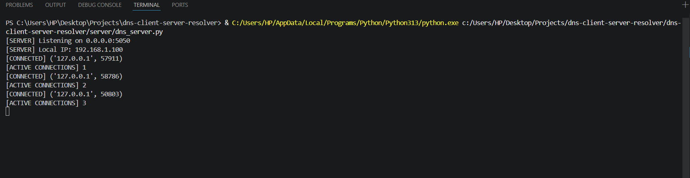
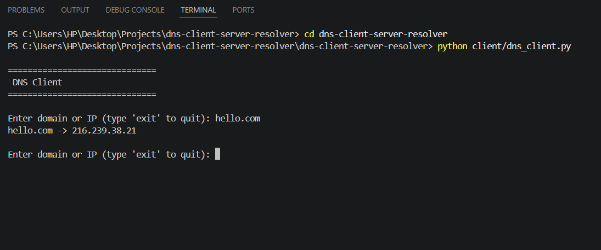
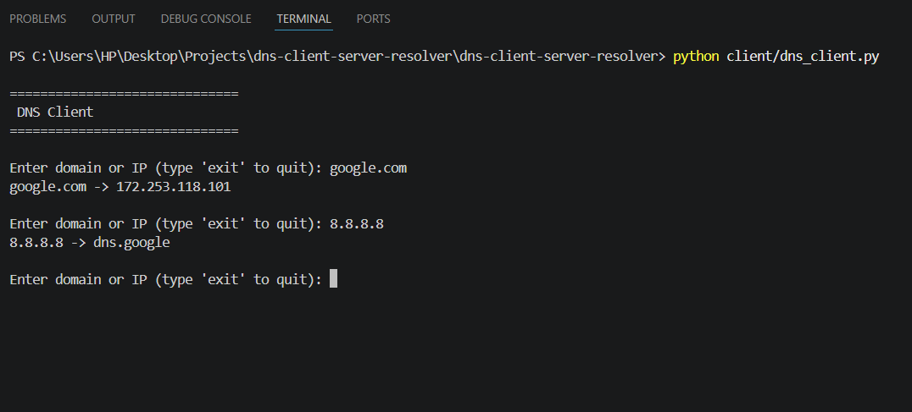
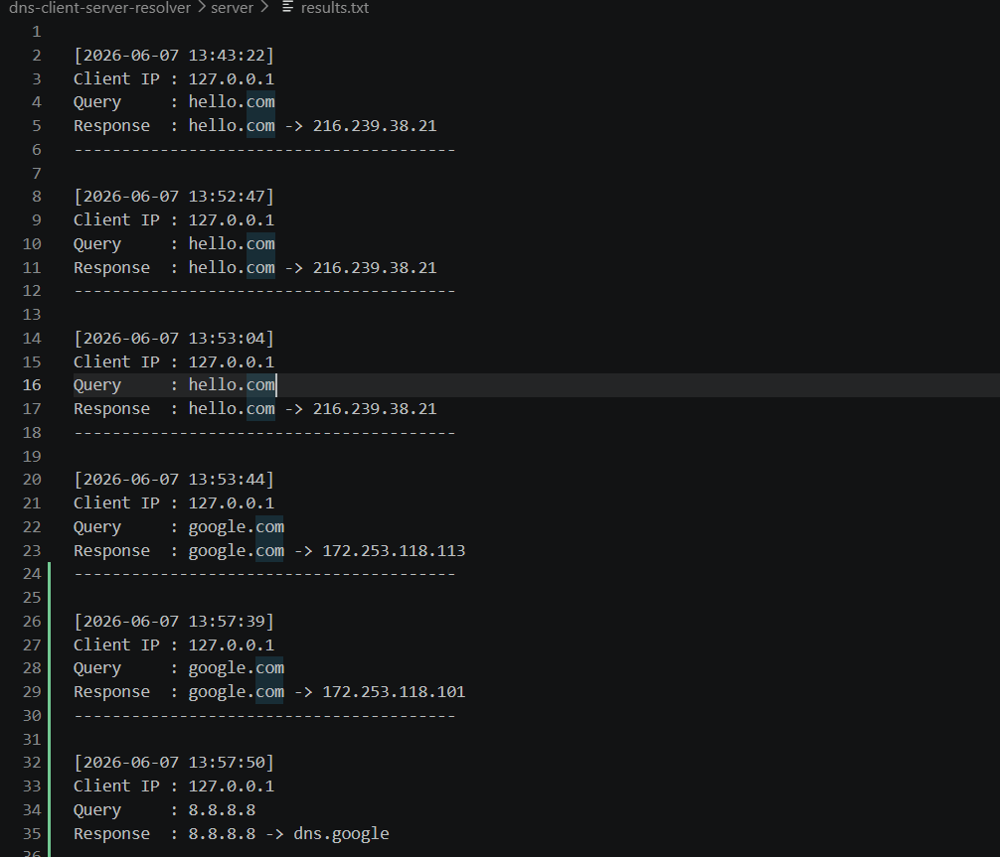

# DNS Client-Server Resolver

A multi-threaded DNS resolution system developed using Python socket programming and a client-server architecture.

The application supports forward DNS lookups (Domain → IP), reverse DNS lookups (IP → Domain), concurrent client handling, query logging, and timestamp tracking.

## Project Overview

This project simulates a DNS resolution service using a client-server architecture. The server accepts requests from multiple clients concurrently and performs forward and reverse DNS lookups using Python's networking libraries.

All queries are logged with timestamps and client IP addresses to provide basic monitoring and auditing capabilities.

## Features

- Forward DNS Lookup (Domain → IP)
- Reverse DNS Lookup (IP → Domain)
- Multi-threaded Client Handling
- Continuous Client Sessions
- Query Logging
- Timestamp Tracking
- Client IP Logging
- Error Handling
- TCP Socket Communication

## Technologies

- Python
- Socket Programming
- TCP/IP Networking
- Multithreading
- File Handling

## Project Structure

```text
dns-client-server-resolver/
│
├── client/
│   └── dns_client.py
│
├── server/
│   ├── dns_server.py
│   └── results.txt
│
├── docs/
│   └── screenshots/
│
├── README.md
└── requirements.txt
```

## Screenshots

### Server Startup



### Forward Lookup



### Reverse Lookup



### Query Logs



## How to Run

### Start Server

```bash
python server/dns_server.py
```

### Start Client

```bash
python client/dns_client.py
```

## Example Usage

```text
Enter domain or IP: google.com

google.com -> 142.250.xxx.xxx
```

```text
Enter domain or IP: 8.8.8.8

8.8.8.8 -> dns.google
```

## Learning Outcomes

Through this project I gained hands-on experience with:

- Client-Server Architecture
- Socket Programming
- DNS Resolution Concepts
- Concurrent Programming with Threads
- Network Communication
- Logging and Monitoring
- Error Handling

## Future Improvements

- Domain validation
- Port scanning integration
- GUI interface
- Deployment on a cloud server
- Advanced DNS record lookups (MX, NS, TXT)